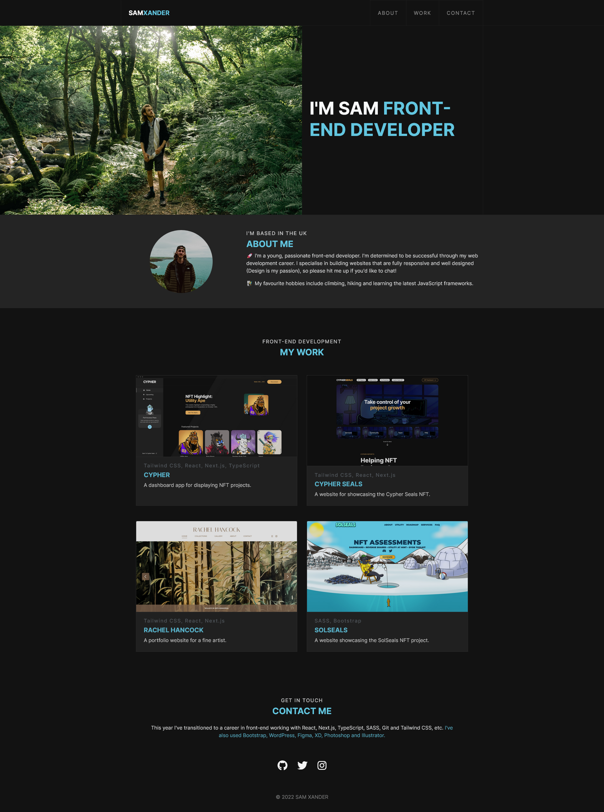

# Bootstrap Portfolio

### View project [here](https://sam-xander.github.io/bootstrap-portfolio/)

The brief for this project was to use [Bootstrap](https://getbootstrap.com/) to prototype a personal portfolio page to showcase my work. The goal was to take my portfolio and use bootstrap styling to recreate the project, acting as practice. This was another project to familiarise myself with the Bootstrap workflow, using the [docs](https://getbootstrap.com/docs/4.6/getting-started/introduction/) to maintain a clean and maintainable codebase. 

#### You can view the original project [here](https://github.com/sam-xander/portfolio)

---

